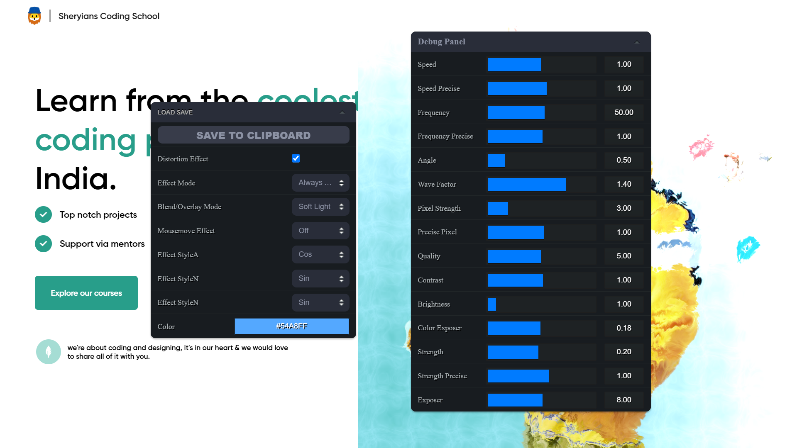

# Shery.js - Cool Effects Library


Shery.js is a powerful and versatile JavaScript library that provides a collection of cool effects and 3d functionalities to enhance the user experience on web applications. With Shery.js, you can easily implement eye-catching and interactive effects, adding a touch of creativity to your projects. This Markdown document serves as the documentation and guide for using Shery.js in your web development projects.

## Table of Contents

1. [Introduction](#introduction)
2. [Installation](#installation)
3. [Getting Started](#getting-started)
   - Required Libraries
4. [Cool Effects](#cool-effects)
   - Mouse Follower
   - Mask Zoomer or Image Masker
   - Make Magnet
   - Text Animate
5. [3D Image Effects](#3d-image-effects)
   - Simple Liquid Distortion Effect
   - Dynamic Distortion Effect
   - Dynamic 3D Wave/Wobble Effect
   - Dynamic 3D Wind Effect
   - 3D Text Effect
6. [Multiple Image (Scroll Effect)](#multiple-image-scroll-effect)
   - Custom Scroll Trigger Callback
7. [Debug Usage](#debug-usage)
   - Preset Usage
8. [Examples](#examples)
9. [Contributing](#contributing)
10. [License](#license)

## Introduction

Shery.js is designed to make it easy for developers to incorporate cool visual effects into their web applications without the need for complex and time-consuming coding. The library leverages the power of Three.js to create stunning 3D effects and animations, and also provides simpler 2D effects for added versatility.

## Installation

To use Shery.js in your project, you can include it in your HTML file via a CDN or by downloading the library and hosting it locally.

```html
<!-- Using the CDN -->
<script src="https://cdn.example.com/shery.js"></script>

<!-- Hosting it locally -->
<script src="path/to/shery.js"></script>
```

## Getting Started

Once you have included Shery.js in your project, you can start using its effects and Three.js functionalities. The library provides a straightforward API to make implementation easier.

```javascript
// Example code to initialize Shery.js and use a cool effect.
const Shery = new Shery()
Shery.mouseFollower()
```

###Required Libraries
To successfully run this project, you'll need some libraries.

```javascript
// Gsap is needed for Basic Effects
    <script src="https://cdnjs.cloudflare.com/ajax/libs/gsap/3.12.2/gsap.min.js"></script>

// Scroll Trigger is needed for Scroll Effects
    <script src="https://cdnjs.cloudflare.com/ajax/libs/gsap/3.12.2/ScrollTrigger.min.js"></script>

// Three.js is needed for 3d Effects
    <script src="https://cdnjs.cloudflare.com/ajax/libs/gsap/3.12.2/gsap.min.js"></script>

// ControlKit is needed for Debug Panel
    <script src="https://cdn.jsdelivr.net/gh/automat/controlkit.js@master/bin/controlKit.min.js"></script>

```

## Cool Effects

These are effects are implemented with the help of Gsap and Css to offer a unique experience with single function.

### Mouse Follower

The feature creates smooth mouse follower, creating an engaging user experience.

```javascript
const Shery = new Shery()
//Parameters are optional.
Shery.mouseFollower({
  skew: true,
  ease: Expo.easeOut,
  duration: 1
})
```

### Mask Zoomer

The mask zoomer effect enables zooming into an image on mouse hover with a smooth mask transition, directing the user's focus to the targeted content.

```javascript
const Shery = new Shery()
//Parameters are optional.
Shery.imageMasker('img', {
  // Element to target.
  //Parameters are optional.
  mouseFollower: true,
  text: 'Shery',
  ease: Expo.easeOut,
  duration: 1
})
```

### Make Magnet

The magnet mouse attractor effect draws elements towards the cursor, as if they are magnetically attracted, offering a unique and interactive experience.

```javascript
const Shery = new Shery()
//Parameters are optional.
Shery.makeMagnet('img', {
  // Element to target.
  //Parameters are optional.
  ease: Expo.easeOut,
  duration: 1
})
```

### Text Animate

The text animate effect animates text with cool animation , with many preset animation, offering a unique experience.

```javascript
const Shery = new Shery()
//Parameters are optional.
Shery.textAnimate('text', {
  // Element to target.
  //Parameters are optional.
  style: 1,
  y: 10,
  delay: 0.1,
  duration: 2,
  ease: Expo.easeOut,
  multiplier: 0.1
})
```

<br>

## 3D Image Effects

These are effects are implemented with the help of Three.js to offer a unique experience with single function.

```javascript
//Must provide a class to image.

var Shery = new Shery();

Shery.imageEffect("img", {
  style: 2, //Select Style
  debug: true, // Debug Panel
  config: { /* Confid made from debug panel */}
  preset:'./presets/wigglewobble.json'
});
```

### Simple Liquid Distortion Effect


The simple liquid distortion effect applies a mesmerizing distortion effect to image, giving the illusion of a liquid-like behavior.

```javascript
var Shery = new Shery()
Shery.imageEffect('.img',{style: 1 /*OR 5 for different variant */ })
```

### Dynamic Distortion Effect


The dynamic distortion effect creates a more advanced and reactive distortion animation, providing an engaging visual experience with a debug panel.

```javascript
var Shery = new Shery()
Shery.imageEffect('img', { style: 2 })
```

### Dynamic 3D Wave/Wobble Effect


Bring your web application to life with the dynamic 3D wave/wobble effect, making elements appear to ripple like waves or wobble like gelatin.

```javascript
var Shery = new Shery()
Shery.imageEffect('img', { style: 3 })
```

### Dynamic 3D Wind Effect


The dynamic 3D wind effect adds a subtle and natural swaying motion to elements, simulating the movement caused by wind.

```javascript
var Shery = new Shery()
Shery.imageEffect('img', { style: 4 })
```

## Multiple Image Scroll Effect


All 3D effects in this library supports multi image with wave scroll effect which increases the productivty and usability of effect, offering a unique and interactive experience.

To use this you just need to give a div with images you want.

```javascript
<div class="images">
  
  
  
</div>

var Shery = new Shery()
Shery.imageEffect('.images', {
  style: 3,
  staticScroll: true // Scroll without any scrollable area on a static page.
})

```

### Custom Scroll Trigger Callback

To implement the GSAP ScrollTrigger or any other scroll library, as well as vanilla JavaScript and to achieve them full potential of Multiple Image Scroll Effect, you can define your custom scroll behavior using the callback parameter `slideStyle` within the **Multiple Image Scroll Effect**.

To define your specific scroll behavior, utilize the `slideStyle` callback in the following manner: `slideStyle: (setScroll) => {}`. This empowers you to establish your own scrolling conditions using the `setScroll()` function within the callback. To successfully implement this approach, adhere to the following steps:

1. Enable the `slideStyle` option for your chosen visual style effect.
2. Invoke the callback, passing in the `setScroll` parameter.
3. Within the callback function, you can dynamically update the scroll position, ranging from 0 to the position of the last image.
4. Employ a scroll event listener within this context to keep track of changes in the scrolling behavior. You can select any suitable method, such as GSAP or other libraries.
5. Inside the event listener, utilize the `setScroll` function and provide the parameter `window.scrollY / innerHeight` to obtain the current scroll position relative to the window height. You can customize this calculation as needed, possibly integrating the progress from GSAP or similar methods.
6. By following these steps, you will successfully implement your own personalized scroll-triggering mechanism.


```javascript

//Here is the code snippet demonstrating this process:

<div class="images">
  
  
  
</div>

var Shery = new Shery();
Shery.imageEffect(".image", {
  style: 5,
  slideStyle: (setScroll) => {
    window.addEventListener('scroll', () => {
      setScroll(window.scrollY / innerHeight); //Updating the scroll
    });
  }
});
```

By adhering to these instructions, you can create and control your unique scroll-triggered effects in the **Multiple Image Scroll Effect** using the specified callback mechanism.

## Debug Usage



To customize any of the 3d effects provided by Shery.js, simply enable debug mode with parameater `{debug:true}` for effects which supports it.

To save/use the tweek from your debug you need to click on ` SAVE TO CLIPBOARD ` and the paste that config in config parameter.

```javascript


var Shery = new Shery()
Shery.imageEffect('.img',
    {
        style: 3,
        debug: true,
        config: {
            "uFrequencyX": { "value": 100, "range": [0, 100] },
            "uFrequencyY": { "value": 44.86, "range": [0, 100] },
            "uFrequencyZ": { "value": 100, "range": [0, 100] },
            "uTime": { "value": 37.14299999999965 }
        }
    })
```

### Preset Usage

Create your own preset or use someone elses with the help of preset option `{preset:'./presets/wigglewobble.json'}` you can create your own preset with the help of debug panel like :-

1. Enable [debug panel](#usage) for your chosen style effect.
2. Do your customization's in debug panel.
3. Now click on **SAVE TO CLIPBOARD** button in debug panel.
4. Now create an new **_.json_** file.
5. Paste the copied config there.
6. And you created a new preset you can use it later or share it and help community.

```javascript
var Shery = new Shery();

Shery.imageEffect("img", {
  style: 2,
  preset:'./presets/wigglewobble.json'
});
```

## Examples

For detailed usage examples and demos of each effect, check out the [examples](link-to-examples) directory in the Shery.js repository.

## Contributing

We welcome contributions from the community to enhance and expand Shery.js. If you encounter bugs, have feature suggestions, or want to contribute code, please check out our [contribution guidelines](link-to-contribution-guidelines) for more information.

## License

Shery.js is released under the [MIT License](link-to-license). Feel free to use it in both personal and commercial projects.

# Shery.js - Cool Effects Library
