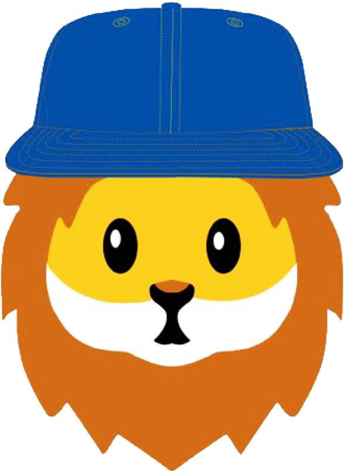

# Shery.js - Cool Effects Library



Shery.js is a powerful and versatile JavaScript library that provides a collection of cool effects and 3d functionalities to enhance the user experience on web applications. With Shery.js, you can easily implement eye-catching and interactive effects, adding a touch of creativity to your projects. This Markdown document serves as the documentation and guide for using Shery.js in your web development projects.

## Table of Contents

1. [Introduction](#introduction)
2. [Installation](#installation)
3. [Getting Started](#getting-started)
4. [Cool Effects](#cool-effects)
   - Mouse Follower
   - Mask Zoomer or Image Masker
   - Make Magnet
   - Text Animate
5. [3D Image Effects](#3d-image-effects)
   - Simple Liquid Distortion Effect
   - Dynamic Distortion Effect
   - Dynamic 3D Wave/Wobble Effect
   - Dynamic 3D Wind Effect
   - 3D Text Effect
6. [Usage](#usage)
7. [Examples](#examples)
8. [Contributing](#contributing)
9. [License](#license)

## Introduction

Shery.js is designed to make it easy for developers to incorporate cool visual effects into their web applications without the need for complex and time-consuming coding. The library leverages the power of Three.js to create stunning 3D effects and animations, and also provides simpler 2D effects for added versatility.

## Installation

To use Shery.js in your project, you can include it in your HTML file via a CDN or by downloading the library and hosting it locally.

```html
<!-- Using the CDN -->
<script src="https://cdn.example.com/shery.js"></script>

<!-- Hosting it locally -->
<script src="path/to/shery.js"></script>
```

## Getting Started

Once you have included Shery.js in your project, you can start using its effects and Three.js functionalities. The library provides a straightforward API to make implementation easier.

```javascript
// Example code to initialize Shery.js and use a cool effect.
const Shery = new Shery();
Shery.mouseFollower();
```

## Cool Effects

### Mouse Follower

The feature creates smooth mouse follower, creating an engaging user experience.

```javascript
const Shery = new Shery();
//Parameters are optional.
Shery.mouseFollower({
  skew: true,
  ease: Expo.easeOut,
  duration: 1,
});
```

### Mask Zoomer

The mask zoomer effect enables zooming into an image on mouse hover with a smooth mask transition, directing the user's focus to the targeted content.

```javascript
const Shery = new Shery();
//Parameters are optional.
Shery.imageMasker("img", {  // Element to target.
  //Parameters are optional.
  mouseFollower: true,
  text: "Shery",
  ease: Expo.easeOut,
  duration: 1,
});
```

### Make Magnet

The magnet mouse attractor effect draws elements towards the cursor, as if they are magnetically attracted, offering a unique and interactive experience.

```javascript
const Shery = new Shery();
//Parameters are optional.
Shery.makeMagnet("img", {  // Element to target.
  //Parameters are optional.
  ease: Expo.easeOut,
  duration: 1,
});
```

### Text Animate

The text animate effect animates text with cool animation , with many preset animation, offering a unique experience.

```javascript
const Shery = new Shery();
//Parameters are optional.
Shery.textAnimate("text", {  // Element to target.
  //Parameters are optional.
  style: 1,
  y: 10,
  delay: 0.1,
  duration: 2,
  ease: Expo.easeOut,
  multiplier: 0.1,
});
```

<br>

## 3D Image Effects

These are effects are implemented with the help of Three.js to offer a unique experience with single function.

```javascript
//Must provide a class to image.

var Shery = new Shery()
Shery.imageEffect('img', {style:1,})

```

### Simple Liquid Distortion Effect

The simple liquid distortion effect applies a mesmerizing distortion effect to image, giving the illusion of a liquid-like behavior.

```javascript
var Shery = new Shery();
Shery.imageEffect("img", { style: 1 });
```

### Dynamic Distortion Effect

The dynamic distortion effect creates a more advanced and reactive distortion animation, providing an engaging visual experience with a debug panel.

```javascript
var Shery = new Shery();
Shery.imageEffect("img", {
  style: 1,
});
```

### Dynamic 3D Wave/Wobble Effect

Bring your web application to life with the dynamic 3D wave/wobble effect, making elements appear to ripple like waves or wobble like gelatin.

```javascript
const dynamicWaveWobble = new Shery.Dynamic3DWaveWobble();
dynamicWaveWobble.init();
```

### Dynamic 3D Wind Effect

The dynamic 3D wind effect adds a subtle and natural swaying motion to elements, simulating the movement caused by wind.

```javascript
const dynamicWind = new Shery.Dynamic3DWind();
dynamicWind.init();
```

### 3D Text Effect

With the 3D text effect, you can create captivating and interactive 3D text elements that respond to user interactions.

```javascript
const text3D = new Shery.ThreeDTextEffect();
text3D.init();
```

## Usage

To use any of the effects or Three.js functionalities provided by Shery.js, simply create an instance of the corresponding class and call the `init()` method. You can customize the effects further by passing configuration options during initialization.

```javascript
const myEffect = new Shery.SomeCoolEffect();
myEffect.init(options);
```

## Examples

For detailed usage examples and demos of each effect, check out the [examples](link-to-examples) directory in the Shery.js repository.

## Contributing

We welcome contributions from the community to enhance and expand Shery.js. If you encounter bugs, have feature suggestions, or want to contribute code, please check out our [contribution guidelines](link-to-contribution-guidelines) for more information.

## License

Shery.js is released under the [MIT License](link-to-license). Feel free to use it in both personal and commercial projects.

---

Congratulations! You now have the GitHub Markdown documentation for your Shery.js library. You can further customize and expand this document based on the specifics of your library and add more detailed instructions and explanations for each effect and Three.js functionality provided by Shery.js. Good luck with your project!
